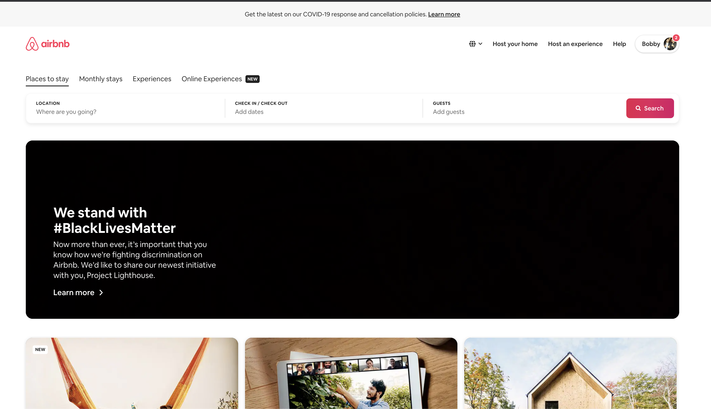

# MeanPug Wordpress Developer Challenge
A challenge for all the potential MP K9's

## How it works
Hello fellow dog lover (if you're not a dog lover, why are you interested in Mean**Pug**??) The purpose of this challenge is just to give us a better idea of what your strengths are and how you might fit in at our upscale institution (/s). Obviously, doing all 3 challenges is going above and beyond, but isn't a requirement. The most competitive applications, though, will complete at least 2 of the challenges (we've tried to make sure they don't take up more than an hour or two at most, we know you'd rather be doing..just about anything else).

### Challenge 1: Pugify that site
Have you ever looked at a site and thought "hey, that site needs some pugs"? No? Well we *certainly* have. In this challenge, you'll take the front-page on a well-known home rental site (hint: it rhymes with `shmair d and d`) and try and replicate the design as the front-page of a wordpress site. No need to replicate functionality (so things like search, dropdowns, etc. aren't required), but the aesthetic should be as close as possible. Outside of mimicking the design, there is one additional requirement: You MUST include one of the MeanPug [pugs](https://media.prod.meanpug.net/wp-content/uploads/sites/9/2020/01/24060038/MeanPug-Best-In-Show-Icon.png) somewhere on the page. _Note: You don't need to replicate the entire page, just the portion above the fold should do:_ 

### Challenge 2: Nothing's sexier than a solid schema
I think we can all agree, you shouldn't judge a book by it's cover but by the structure of its schema. For this challenge, we give you the outline of a project and ask you to fill in the skeleton. What does that mean? That means adding backend structures like:

* Plugins
* Any custom post types and/or custom taxonomy definitions
* A sane project structure
* Any additional data structures you think might be relevant to a complete implementation

### Challenge 3: Show us what you got
For this challenge, you don't need to do _anything at all_. Ok, that's a bit misleading. What we want to see is the complete
git history for one of your past projects. The full requirements are:

* You should be the sole collaborator on the project
* The project should have been started within the past 3 years
* Make this an example of your best work! In other words, make sure you [hit us with your best shot](https://www.youtube.com/watch?v=x5kisPBwZOM).
